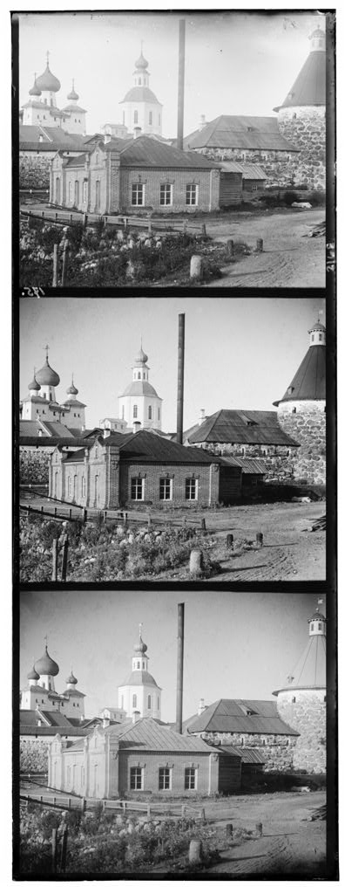
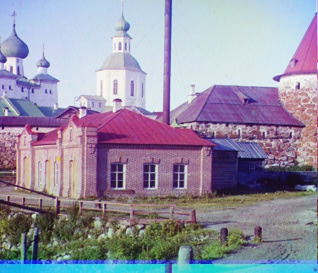
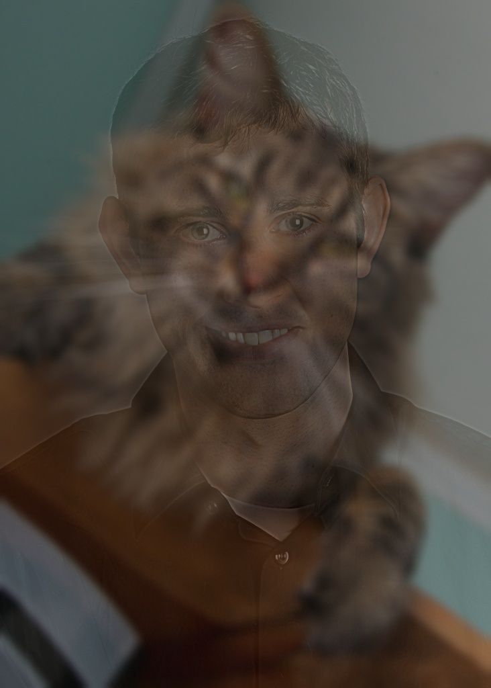

# Berkeley-Intro-to-Computer-Vision-and-Computational-Photography

Course Code: CS194-26

## Project1 : Images of the Russian Empire -- Colorizing the Prokudin-Gorskii Photo Collection

Image alignment

Given spilt R、G、B channel gray-scale image, use NCC(Normalized Cross-Correlation) to align the images and covert to a RGB image

  

## Project2 : Fun with Frequencies
### Part 1 : Edge detection

First, apply Gaussian blur to reduce noise, then use convolution to approximate the partial derivatives in the x and y directions, and finally set a threshold for edge detection.

 

### Part 2
#### Part 2-1 : Image sharpening

Add a little bit more high frequencies to sharpen the image

 

#### Part 2-2 : Hybric image

High frequency tends to dominate perception when it is available, but, at a distance, only the low frequency (smooth) part of the signal can be seen. 

By blending the high frequency portion of one image with the low-frequency portion of another, we can get a hybrid image that leads to different

Result:If you look the picture at a distance, you will clearly see the cat.

